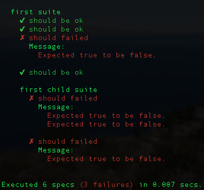

jasmine-spec-reporter
=====================

[](https://travis-ci.org/bcaudan/jasmine-spec-reporter)
[](https://coveralls.io/r/bcaudan/jasmine-spec-reporter?branch=master)

Real time console spec reporter for jasmine behavior-driven development testing framework.



# Usage

## Installation
Install `jasmine-spec-reporter` via npm:

    npm install jasmine-spec-reporter --save-dev

## Configuration
* [Jasmine node tests](docs/jasmine-npm-configuration.md)
* [Protractor tests](docs/protractor-configuration.md)

## Custom output
You can customize the output of the reporter yourself: [see how](docs/customize-output.md).

# Default options

```js
{
  displayStacktrace: 'none',      // display stacktrace for each failed assertion, values: (all|specs|summary|none)
  displaySuccessesSummary: false, // display summary of all successes after execution
  displayFailuresSummary: true,   // display summary of all failures after execution
  displayPendingSummary: true,    // display summary of all pending specs after execution
  displaySuccessfulSpec: true,    // display each successful spec
  displayFailedSpec: true,        // display each failed spec
  displayPendingSpec: false,      // display each pending spec
  displaySpecDuration: false,     // display each spec duration
  displaySuiteNumber: false,      // display each suite number (hierarchical)
  colors: {
    success: 'green',
    failure: 'red',
    pending: 'yellow'
  },
  prefixes: {
    success: '✓ ',
    failure: '✗ ',
    pending: '* '
  },
  customProcessors: []
}
```

Colors are displayed in the console via [colors](https://github.com/Marak/colors.js), you can see all available colors on the [project page](https://github.com/Marak/colors.js).
You can also disable colors with the option: `colors: false`.

# Compatibility with Jasmine 1.x

To use Jasmine spec reporter with Jasmine 1.x, please see [jasmine1 branch](https://github.com/bcaudan/jasmine-spec-reporter/tree/jasmine1).

# Developement

* install dependencies: `npm install`
* launch all unit tests: `npm test`
* launch an output example: `npm run example`
* launch a protractor example:
```sh
npm run webdriver-update # if needed
npm run webdriver-start
npm run protractor-example
```

# Contribution

## Bug

If you find a bug in the source code or a mistake in the documentation, feel free to submit an issue or even better a pull request with a fix and **appropriate test cases**.

## Feature

If you want a new feature, you can do the same but some types of features would probably not be integrated:

* options to tweak output format
* options to add extra information to specific sections (spec, suite, summary)

There is already a lot of options, so to add your specific behavior to the reporter, please consider to [build and use your own display processor](docs/customize-output.md).

